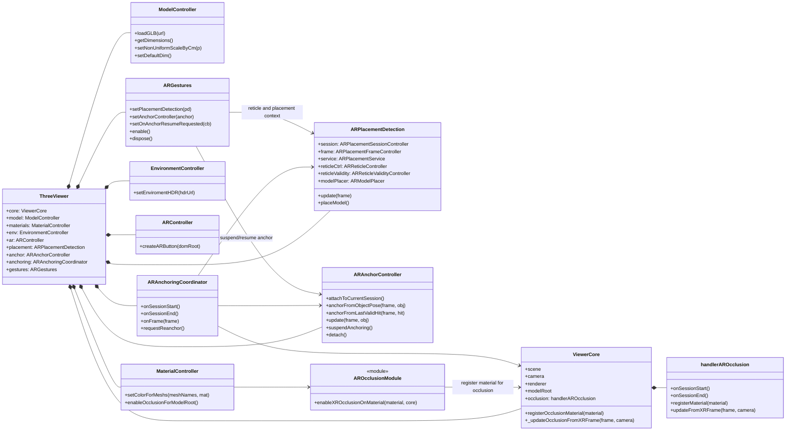

# Class diagram generale AR (aggiornato)

## Obiettivo
Unire in un unico diagramma le funzionalita principali attive:
- gestione viewer e rendering
- load/modifica modello
- placement AR
- anchor + coordinamento re-anchor
- gesture
- occlusione XR

## Lettura rapida
- placement e anchoring lavorano in parallelo: il coordinator crea/recrea anchor quando serve.
- gesture sospende l anchor durante manipolazione e richiede re-anchor al rilascio.
- occlusione e separata: materiali patchati da `AROcclusion` e aggiornati per-frame da `handlerAROcclusion`.
