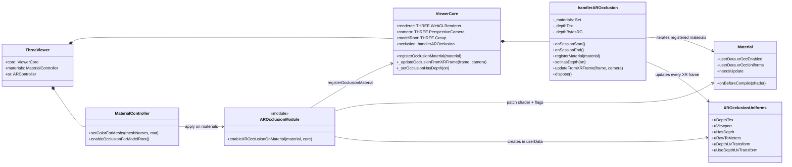

# Class diagram occlusione XR

## Obiettivo
Rappresentare le relazioni tra i moduli che implementano l occlusione XR nel codice attuale.

## Note
- `AROcclusionModule` rappresenta il file `AROcclusion.js` (funzione export), non una classe ES6.
- `handlerAROcclusion` e il manager runtime usato realmente da `ViewerCore`.
