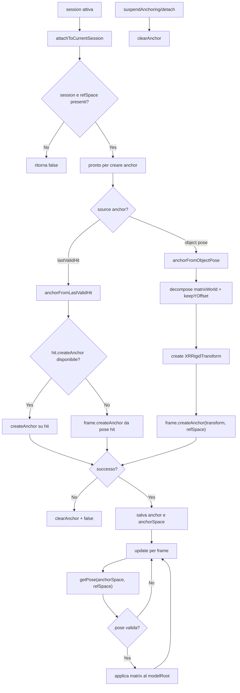
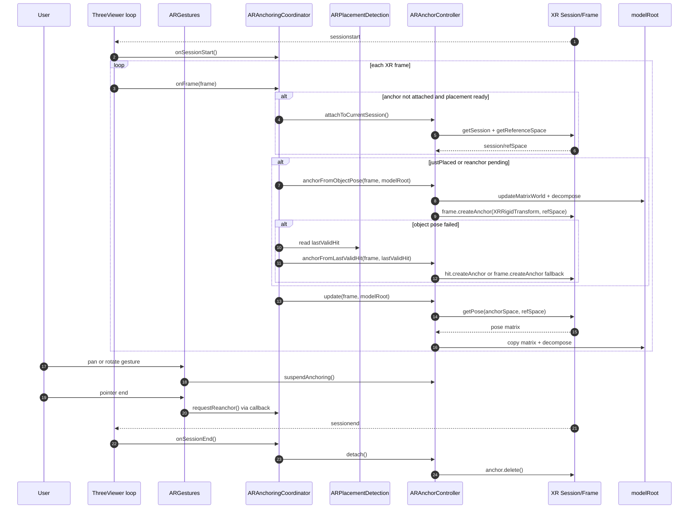
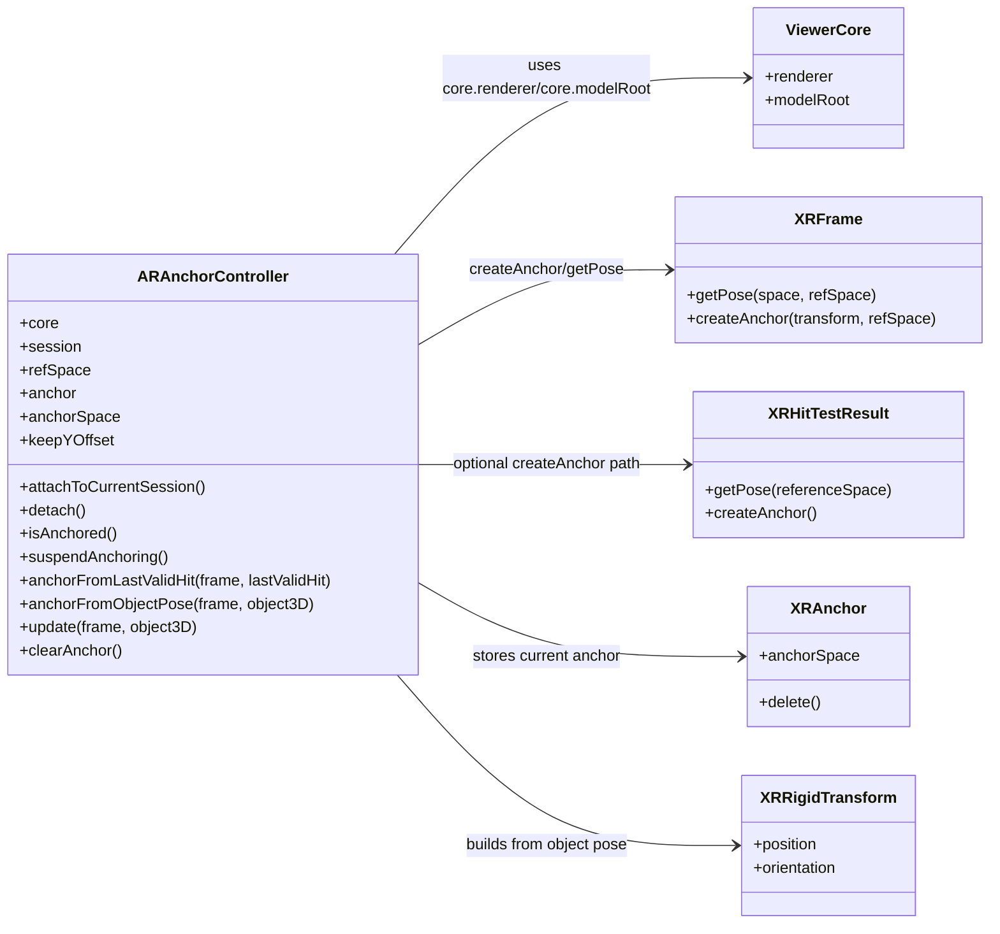
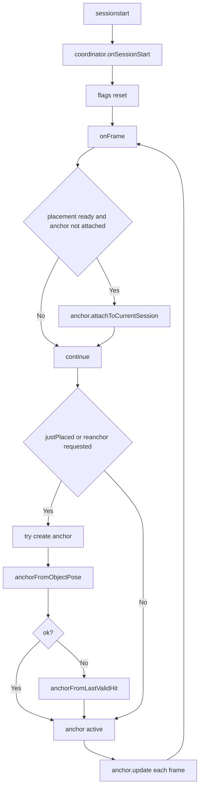

# Flusso logico ARAnchorController (completo)

## 1. Obiettivo
`ARAnchorController` mantiene il modello agganciato a un anchor WebXR per stabilizzare la posa nel mondo reale.

Capacita principali:
- agganciare da hit-test (`anchorFromLastValidHit`)
- agganciare dalla posa corrente del modello (`anchorFromObjectPose`)
- aggiornare il modello per-frame seguendo l anchor
- sospendere/ripristinare ancoraggio con cleanup sicuro

## 2. Moduli e dipendenze
- `ARAnchorController.js`: logica anchor
- `ViewerCore`: fornisce `renderer.xr`, `camera`, `modelRoot`
- `ARPlacementDetection`: fornisce tipicamente `lastValidHit` per primo anchor
- WebXR API: `XRAnchor`, `XRSpace`, `XRRigidTransform`, `frame.getPose`

## 3. Stato interno
- `session`: sessione XR corrente
- `refSpace`: reference space per risolvere pose
- `anchor`: handle `XRAnchor`
- `anchorSpace`: spazio dell anchor
- `keepYOffset`: offset Y opzionale post-ancoraggio
- temporanei math: `_tmpM4`, `_tmpPos`, `_tmpQuat`, `_tmpScale`

## 4. Flusso dettagliato

### 4.1 Attach/detach sessione
`attachToCurrentSession()`:
1. legge session e referenceSpace da `core.renderer.xr`
2. salva in stato interno
3. ritorna true solo se entrambi disponibili

`detach()`:
1. `clearAnchor()`
2. azzera `session` e `refSpace`

### 4.2 Creazione anchor da last valid hit
`anchorFromLastValidHit(frame, lastValidHit)`:
1. valida prerequisiti (`frame`, `refSpace`, `hit`)
2. path preferito: `hit.createAnchor()` se disponibile
3. fallback: `frame.createAnchor(pose.transform, refSpace)`
4. su successo aggiorna `anchor` e `anchorSpace`
5. su errore esegue cleanup e ritorna false

### 4.3 Creazione anchor dalla posa oggetto
`anchorFromObjectPose(frame, object3D)`:
1. valida prerequisiti (`frame`, `refSpace`, `object3D` o `core.modelRoot`)
2. decompone `matrixWorld` in posizione+rotazione+scala
3. applica offset `keepYOffset` se impostato
4. crea `XRRigidTransform`
5. chiama `frame.createAnchor(transform, refSpace)`
6. salva `anchor` e `anchorSpace` su successo

### 4.4 Update per-frame: follow anchor
`update(frame, object3D)`:
1. esce se manca `frame`, `anchorSpace` o `refSpace`
2. risolve `pose = frame.getPose(anchorSpace, refSpace)`
3. converte `pose.transform.matrix` in `Matrix4`
4. copia su `obj.matrix` e decompone su `position/quaternion/scale`

Effetto: il modello segue il tracking dell anchor invece della sola posa iniziale hit-test.

### 4.5 Suspend e cleanup
- `suspendAnchoring()`: invoca `clearAnchor()` (utile durante pan)
- `clearAnchor()`:
  - prova `anchor.delete()`
  - azzera `anchor` e `anchorSpace`

## 5. Mermaid flowchart

## 6. Sequence diagram

## 7. Class diagram

## 8. Limiti e attenzioni
- se il device/sessione non supporta anchors, i metodi tornano false
- `update` non modifica nulla se `anchorSpace` non e attivo
- conviene chiamare `suspendAnchoring` durante pan per evitare conflitti tra gesture e follow anchor
- `keepYOffset` va usato con cura per non introdurre drift verticale percepito

## 9. Integrazione con ARAnchoringCoordinator (nuovo)
Nel codice attuale, `ARAnchorController` non viene chiamato direttamente dal loop principale: c e `ARAnchoringCoordinator` che decide quando agganciare/re-agganciare.

Regole operative del coordinator:
- su `sessionstart` resetta i flag interni
- appena placement e ready prova `attachToCurrentSession`
- quando rileva `justPlaced` imposta `reanchorPending`
- durante gesture, il sistema puo chiamare `requestReanchor()`
- su ogni frame prova a creare anchor se pendente (`anchorFromObjectPose`, fallback `anchorFromLastValidHit`)
- poi chiama sempre `anchor.update(frame, modelRoot)`

