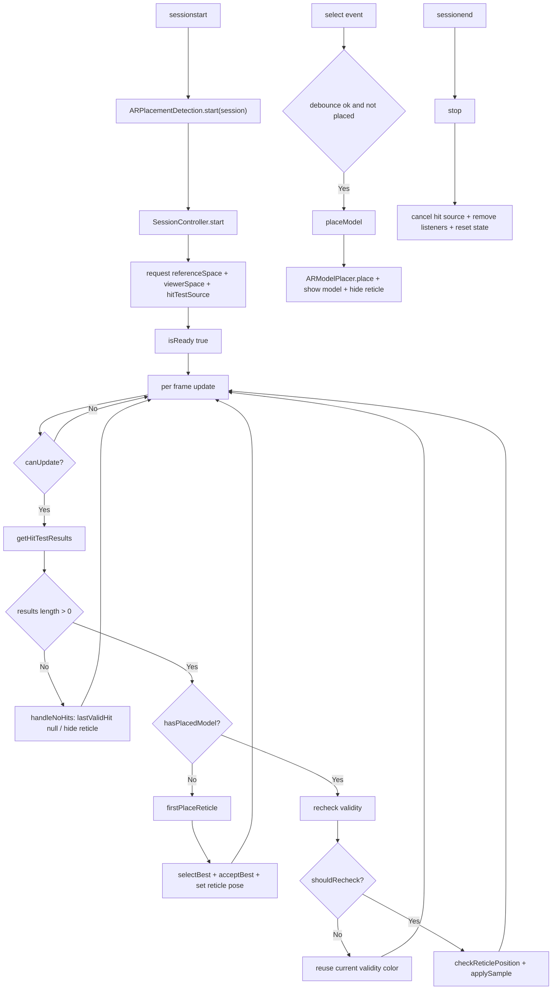
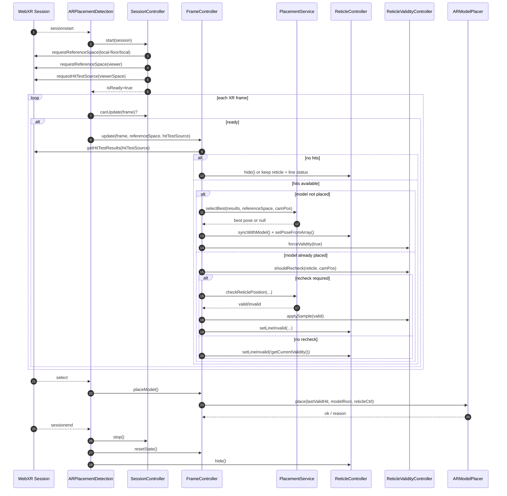
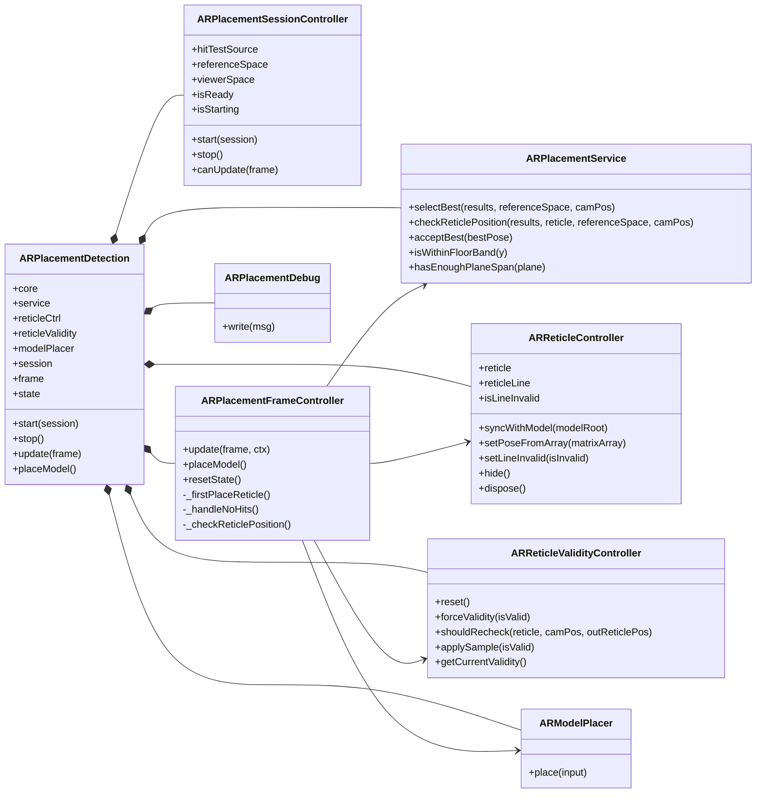

# Flusso logico ARPlacementDetection (completo)

## 1. Obiettivo
`ARPlacementDetection` gestisce il posizionamento del modello in AR su superfici valide usando hit-test WebXR.

Risultati che produce:
- trova una posa valida (`lastValidHit`) coerente con i vincoli di piano/pavimento
- mostra e aggiorna il reticle
- valida la posizione durante pan/ri-posizionamento
- piazza il modello (tap o autoplace)
- ripristina stato e listener quando la sessione termina

## 2. Moduli coinvolti
- `ARPlacementDetection.js`: orchestratore principale
- `ARPlacementSessionController.js`: lifecycle sessione, ref-space, hit-test source, select listener
- `ARPlacementFrameController.js`: logica per-frame
- `ARPlacementService.js`: selezione/filtro hit e validazione geometrica
- `ARModelPlacer.js`: applica posa finale al `modelRoot`
- `ARReticleController.js`: gestione reticle e linea di validita
- `ARReticleValidityController.js`: hysteresis e soglie di recheck
- `ARPlacementDebug.js`: output debug su DOM

## 3. Stato condiviso

### 3.1 Stato alto livello (`ARPlacementDetection.state`)
- `lastValidHit`: ultima posa valida
- `hasPlacedModel`: modello gia piazzato o no
- `debugFrameCount`: campionamento debug

### 3.2 Stato sessione (`ARPlacementSessionController`)
- `referenceSpace`: `local-floor` (fallback `local`)
- `viewerSpace`: usato per creare hit-test source
- `hitTestSource`: sorgente hit-test attiva
- `isReady` / `isStarting`: stato readiness
- `ignoreSelectUntil`: debounce iniziale tap
- `boundSession`: sessione su cui registrare/rimuovere listener

### 3.3 Stato reticle validity
- posizione ultima valutazione reticle/camera
- soglie di recheck (`reticleRecheckMoveThreshold`, `reticleRecheckCamMoveThreshold`)
- hysteresis colore (`reticleColorHysteresisFrames`)

## 4. Flusso dettagliato

### 4.1 Costruzione e wiring
Nel costruttore di `ARPlacementDetection`:
1. inizializza service/reticle/debug/validity/modelPlacer
2. crea `session controller` con callback `onSelect`
3. crea `frame controller` passando dipendenze e `state` condiviso
4. registra listener globali XR su `renderer.xr`:
   - `sessionstart` -> `onSessionStart`
   - `sessionend` -> `onSessionEnd`

### 4.2 Start sessione
`onSessionStart`:
1. prende la sessione XR corrente
2. chiama `start(session)`

`start(session)`:
1. `session.start(session)` su `ARPlacementSessionController`
2. reset stato placement (`hasPlacedModel=false`, `lastValidHit=null`)
3. reset validity
4. se `hideModelUntilPlacement`, nasconde `modelRoot`
5. scrive debug readiness

Dettaglio `ARPlacementSessionController.start(session)`:
1. richiede `referenceSpace` (`local-floor`, fallback `local`)
2. richiede `viewerSpace`
3. crea `hitTestSource` con `viewerSpace`
4. imposta `ignoreSelectUntil = now + 800ms`
5. registra listener `select` se `allowTapPlacement`
6. imposta `isReady=true`

### 4.3 Update per frame
`ARPlacementDetection.update(frame)`:
1. `canUpdate(frame)` deve essere vero (XR presenting + frame + ready + ref space + hit source)
2. delega a `frame.update(frame, { referenceSpace, hitTestSource })`

`ARPlacementFrameController.update(...)`:
1. legge `results = frame.getHitTestResults(hitTestSource)`
2. se non ci sono hit:
   - reset `lastValidHit`
   - se modello gia piazzato e reticle visibile, aggiorna solo stato validita
   - altrimenti nasconde reticle
3. se modello non ancora piazzato:
   - `reticleCtrl.syncWithModel(modelRoot)`
   - `service.selectBest(results, referenceSpace, camPos)`
   - se best esiste: salva `lastValidHit`, `acceptBest(best)`, posa reticle
   - forza validita true per partire verde
4. se modello gia piazzato:
   - applica logica di recheck (camera+reticle)
   - se serve recheck: `service.checkReticlePosition(...)`
   - aggiorna colore linea con hysteresis

### 4.4 Filtro e scoring hit (`ARPlacementService`)
`selectBest(results, referenceSpace, camPos)` applica:
- filtro orientazione piano (se disponibile)
- filtro semantico floor (opzionale)
- filtro dimensione piano (`hasEnoughPlaneSpan`)
- filtro inclinazione via up vector (`minUpDot`)
- filtro altezza sotto camera (`minBelowCameraMeters`)
- filtro distanza minima camera-hit (`minHitDistanceMeters`)
- filtro banda pavimento (`isWithinFloorBand`)
- scoring finale (delta floor pesato + distanza)

Se nessun hit passa i filtri principali, usa fallback su hit con quota minima osservata.

### 4.5 Tap placement / placeModel
`onSelect()`:
1. ignora se modello gia piazzato
2. ignora se ancora nel debounce (`ignoreSelectUntil`)
3. chiama `placeModel()`

`placeModel()` (delegato a `ARModelPlacer.place`):
1. valida prerequisiti (`lastValidHit`, `modelRoot`)
2. decide target center (hit o reticle corrente)
3. applica offset locale del reticle center
4. imposta posizione iniziale modello
5. calcola box del modello e lift su asse Y per appoggio a pavimento
6. rende modello visibile, marca `hasPlacedModel=true`, reset validity, nasconde reticle

### 4.6 Stop / dispose
`stop()`:
- stop session controller (rimuove listener select, cancella hit source)
- reset frame state
- nasconde reticle
- reset service floor estimate
- rimette `modelRoot.visible = true`

`dispose()`:
- chiama `stop()`
- rimuove listener `sessionstart/sessionend`
- `reticleCtrl.dispose()`

## 5. Mermaid flowchart

## 6. Sequence diagram

## 7. Class diagram

## 8. Parametri critici
- `minUpDot`: quanta orizzontalita richiedere al piano
- `maxFloorDelta`: tolleranza verticale attorno al floor stimato
- `minPlaneSpanMeters`: dimensione minima del piano rilevato
- `reticleColorHysteresisFrames`: stabilita colore valid/invalid
- `ignoreSelectUntil`: evita tap involontario subito dopo lo start

## 9. Integrazione con anchor e gesture (nuovo)
Nel runtime aggiornato di `ThreeViewer`:
- `placement.update(frame)` e chiamato a ogni frame
- subito dopo viene chiamato `anchoring.onFrame(frame)`
- quando l utente manipola il modello, `ARGesture` sospende temporaneamente anchor
- al rilascio gesture richiede `requestReanchor()` al coordinator

Questo evita che l anchor "tiri indietro" il modello durante rotate/pan e garantisce ri-aggancio automatico appena finita la manipolazione.
