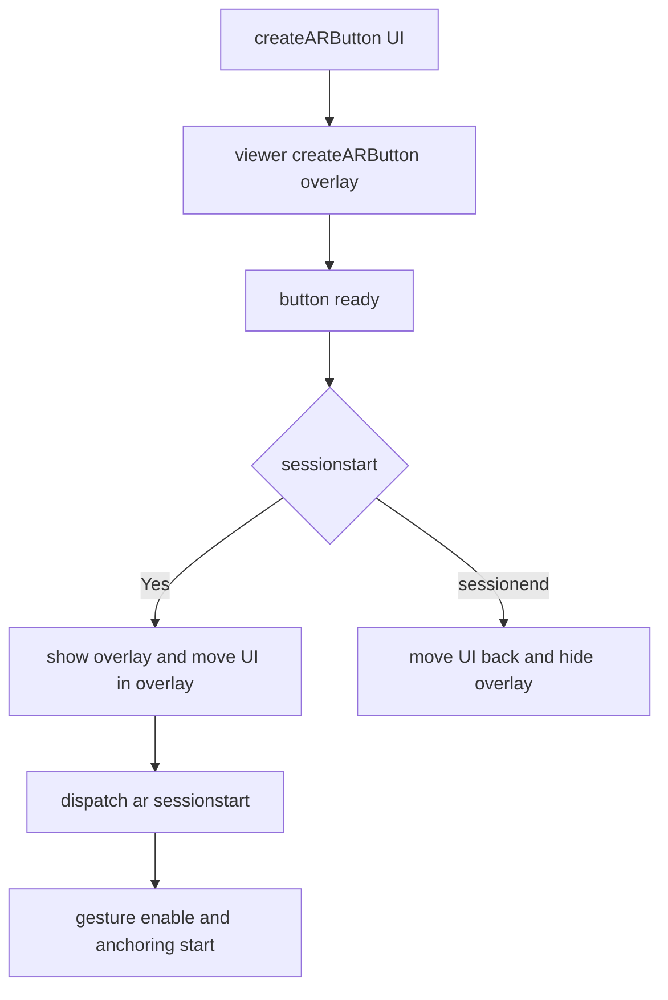
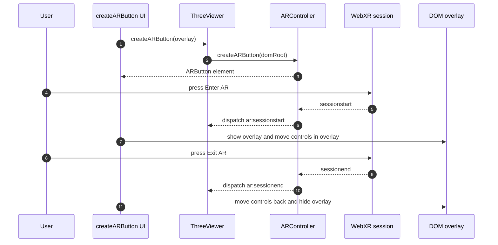
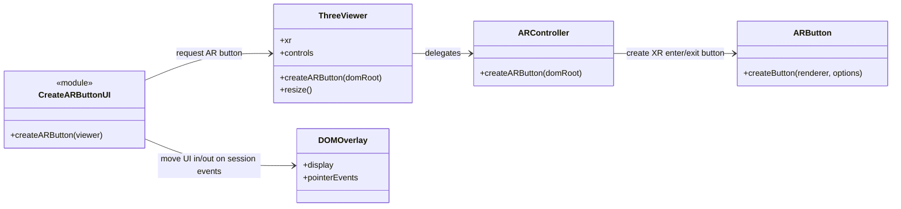

# Meccanismo avvio AR e overlay UI

## Scopo
Creare ARButton, gestire overlay DOM in sessione AR e spostare UI tra layout normale e overlay AR.

## File coinvolti
- `src/script/ui/createARButton.js`
- `src/script/ar/ARController.js`
- `src/script/viewer/ThreeViewer.js`

## Flusso reale
1. `createARButton(viewer)` prepara nodi DOM (`overlay`, host bottone, panel, fab).
2. Chiama `viewer.createARButton(overlay)`.
3. `ARController.createARButton` crea il bottone con feature XR:
   - required: `hit-test`
   - optional: `dom-overlay`, `plane-detection`, `depth-sensing`, `anchors`
4. Su `sessionstart`:
   - overlay visibile e interattivo
   - bottone e pannello spostati dentro overlay
   - eventi `ar:sessionstart` attivano gesture e anchoring reset
5. Su `sessionend`:
   - UI torna nel layout normale
   - overlay nascosto
   - resize e update controls

## Effetto
L UI rimane usabile in AR senza bloccare le gesture sulla superficie XR quando la sessione termina.

## Sequence diagram

## Class diagram

