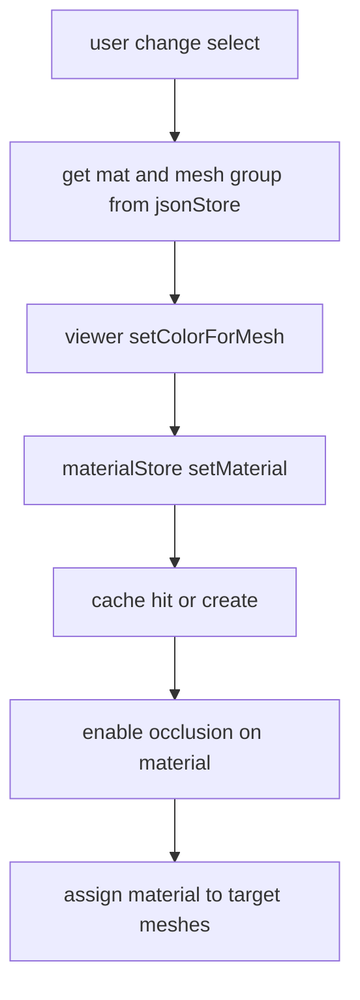
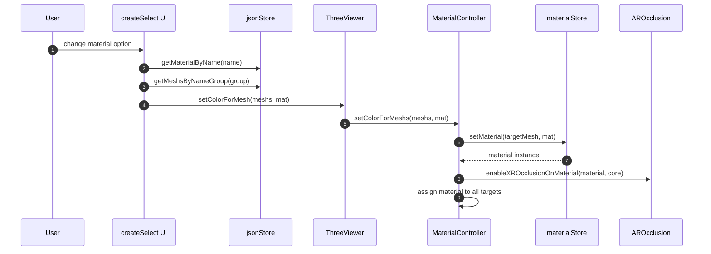
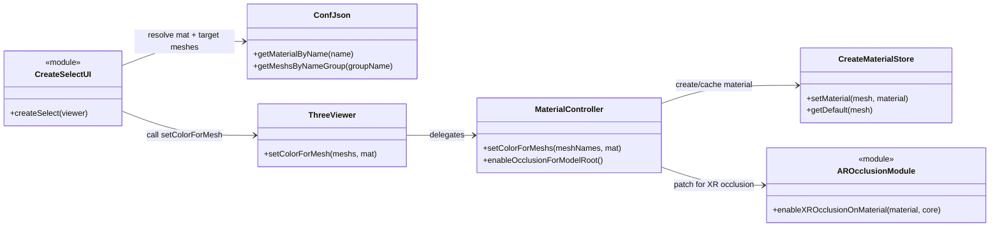

# Meccanismo cambio colore materiali

## Scopo
Cambiare materiale per gruppi di mesh scelti da UI, con cache e compatibilita occlusione XR.

## File coinvolti
- `src/script/ui/createSelect.js`
- `src/script/viewer/MaterialController.js`
- `src/script/materials/CreateMaterial.js`
- `src/script/handler/handlerMaterial.js`
- `src/script/ar/AROcclusion.js`

## Flusso reale
1. `createSelect` costruisce select per ogni gruppo materiale dal JSON.
2. Su `change`:
   - recupera materiale scelto da `jsonStore.getMaterialByName`
   - recupera mesh target del gruppo
   - chiama `viewer.setColorForMesh(meshs, mat)`
3. `MaterialController.setColorForMeshs`:
   - trova oggetti in scena per nome
   - ottiene materiale da `materialStore.setMaterial`
   - abilita occlusione sul materiale (`enableXROcclusionOnMaterial`)
   - applica materiale uguale a tutte le mesh target
4. `CreateMaterial` cachea materiali per nome e conserva il default per mesh.

## Tipi materiale supportati
- `standard` con colore pieno
- texture map caricata da URL
- `Default` per ripristinare materiale originale salvato

## Sequence diagram

## Class diagram

