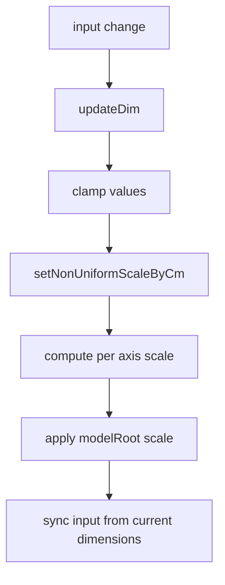
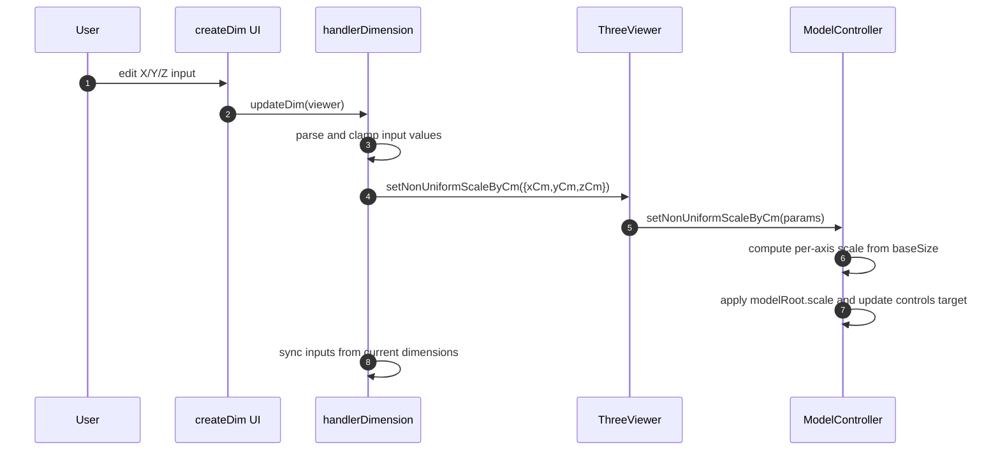
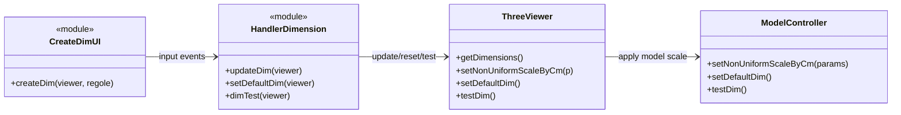

# Meccanismo cambio dimensioni

## Scopo
Scalare il modello in modo non uniforme su X Y Z usando input in centimetri e vincoli min/max.

## File coinvolti
- `src/script/ui/createDim.js`
- `src/script/handler/handlerDimension.js`
- `src/script/viewer/ModelController.js`

## Flusso reale
1. `createDim` crea input numerici per dimensioni consentite dalle regole JSON.
2. Su cambio input chiama `updateDim(viewer)`.
3. `updateDim`:
   - legge e clampa valori da input
   - converte in cm target per asse
   - invoca `viewer.setNonUniformScaleByCm`.
4. `ModelController.setNonUniformScaleByCm`:
   - usa `baseSizeMeters` per calcolare fattori scala
   - applica clamp minimo (`minScaleRatio`)
   - applica scala su `modelRoot`
   - aggiorna target controlli desktop
5. Pulsanti aggiuntivi:
   - `reset` -> `setDefaultDim`
   - `test` -> `testDim`

## Formula chiave
`scaleX = targetX_m / baseSizeX_m` (stesso per Y e Z)

## Sequence diagram

## Class diagram

