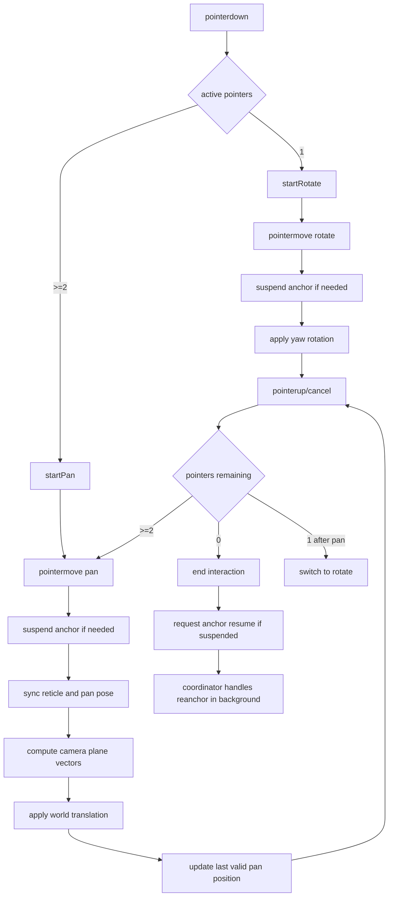
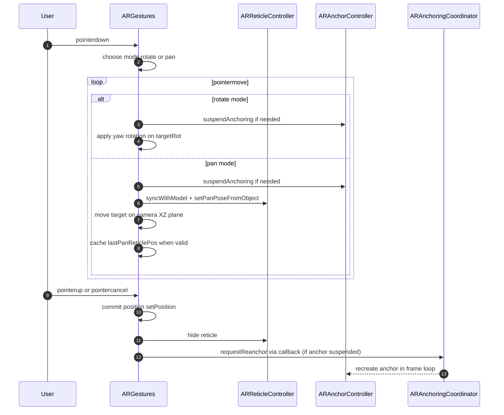
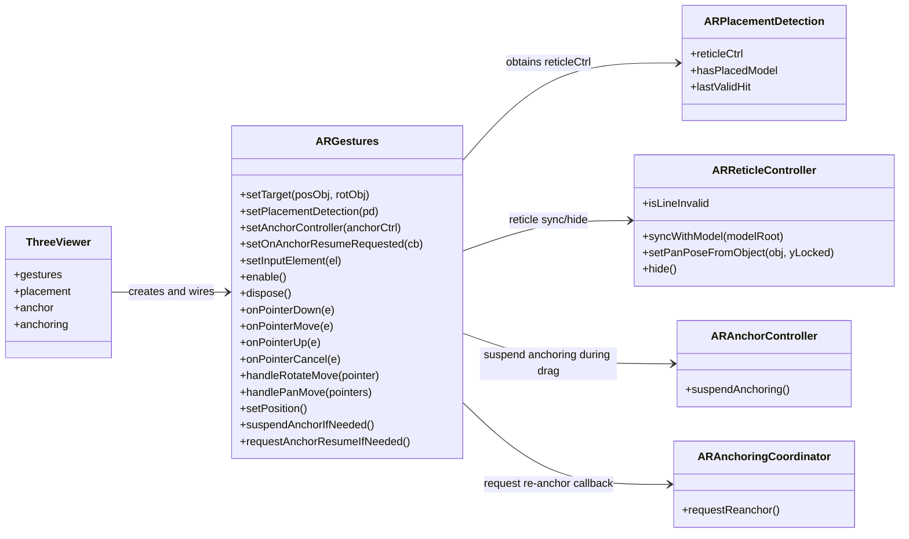

# Flusso logico gesture AR

## 1. Obiettivo
Gestire la manipolazione del modello in AR tramite touch/pointer con due modalita operative:
- `rotate` (1 dito)
- `pan` (2 o piu dita)

Il re-anchor e presente come supporto per stabilizzare il modello dopo la manipolazione, ma il protagonista del flusso e `ARGesture`.

## 2. File coinvolti
- `src/script/ar/ARGesture.js`
- `src/script/ar/ARReticleController.js`
- `src/script/ar/ARAnchorController.js` (supporto)
- `src/script/ar/ARAnchoringCoordinator.js` (supporto)
- `src/script/viewer/ThreeViewer.js`

## 3. Stato interno di ARGesture
Variabili chiave:
- controllo input: `el`, `enabled`, `_activePointers`, `active`, `mode`
- rotate: `lastX`, `lastY`, stato tap (`tapStartX`, `tapStartY`, `tapMoved`)
- pan: `panLastCenterX`, `panLastCenterY`, `panPlaneY`, `panSpeed`, `lastPanReticlePos`
- contesto scena: `target`, `targetRot`, `reticleCtrl`, `placementDetection`
- integrazione anchor: `anchorCtrl`, `onAnchorResumeRequested`, `_anchorSuspendedByGesture`

## 4. Inizializzazione e wiring
In `ThreeViewer`:
1. crea `ARGestures(this.core)`
2. collega `setPlacementDetection(this.placement)`
3. collega `setAnchorController(this.anchor)`
4. collega callback `setOnAnchorResumeRequested(() => this.anchoring.requestReanchor())`
5. su `ar:sessionstart` abilita le gesture
6. su `ar:sessionend` disabilita e pulisce

## 5. Flusso operativo dettagliato

### 5.1 Attivazione/disattivazione
- `enable()` registra listener pointer su input surface.
- `dispose()` rimuove listener e resetta stato locale.
- `setInputElement(...)` permette di spostare dinamicamente la superficie input tra canvas e overlay AR.

### 5.2 Pointer down e cambio modalita
- primo pointer attivo: `startRotate(pointer)`
- da due pointer in su: `startPan(pointers)`

`startRotate`:
- imposta `mode = rotate`
- salva coordinate iniziali
- resetta stato tap
- nasconde reticle

`startPan`:
- imposta `mode = pan`
- calcola centro dita
- salva quota pan (`panPlaneY`) dalla posizione target corrente
- salva posizione fallback (`lastPanReticlePos`)

### 5.3 Rotate move (1 dito)
`handleRotateMove(pointer)`:
1. verifica sessione XR attiva
2. sospende anchor se necessario (`suspendAnchorIfNeeded`)
3. calcola delta X schermo
4. aggiorna rotazione yaw: `targetRot.rotation.y += dx * 0.01`

### 5.4 Pan move (2 dita)
`handlePanMove(pointers)`:
1. verifica sessione XR attiva
2. sospende anchor se necessario
3. sincronizza reticle su target (`syncWithModel`, `setPanPoseFromObject`)
4. mantiene policy quota (`target.position.y = panPlaneY + heightOffset` durante drag)
5. calcola delta centro dita
6. ricava assi camera flatten su piano XZ (`forward`, `right`)
7. converte delta schermo -> movimento world con `panSpeed`
8. aggiorna posizione target su piano
9. se reticle valida, aggiorna `lastPanReticlePos`

### 5.5 Pointer end e commit posizione
`handlePointerEnd(e)`:
- quando si passa da >=2 pointer a <2:
  - `setPosition()` conferma posizione finale
  - nasconde reticle
  - se resta 1 pointer torna a `rotate`
  - se non restano pointer chiude interazione
- quando non restano pointer:
  - chiude interazione
  - chiede resume anchor se era stato sospeso

`setPosition()`:
- usa `lastPanReticlePos` come posa valida finale
- allinea Y a `panPlaneY`

### 5.6 Re-anchor come supporto
- durante gesture: `suspendAnchorIfNeeded()` chiama `anchorCtrl.suspendAnchoring()` una sola volta
- fine gesture: `requestAnchorResumeIfNeeded()` invoca callback
- callback delega al coordinator: `requestReanchor()`
- il coordinator gestisce la ricreazione anchor nel suo loop per-frame

## 6. Mermaid flowchart

## 7. Sequence diagram

## 8. Class diagram

## 9. Parametri di tuning utili
- `panSpeed`: sensibilita pan in metri per pixel
- `heightOffset`: offset verticale durante pan
- `tapMaxMovePx`, `tapMaxDurationMs`: soglie tap/drag
- `yAcceptError`: tolleranza verticale (se usata nelle evoluzioni future)

## 10. Comportamento atteso
- manipolazione stabile e prevedibile in AR
- nessun conflitto diretto tra gesture e aggiornamento anchor
- reticle coerente con modello durante pan
- re-anchor automatico solo dopo fine interazione
