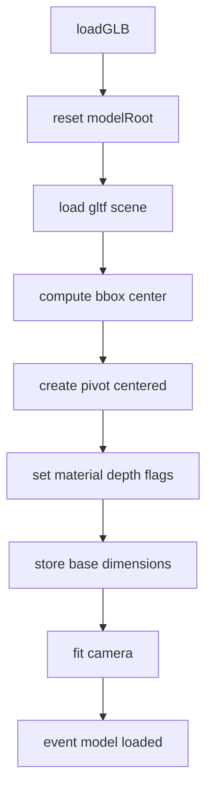
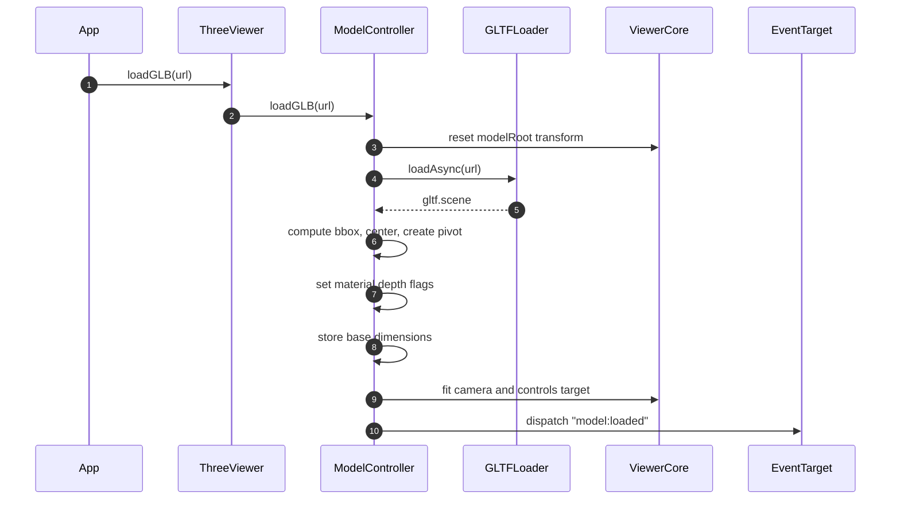
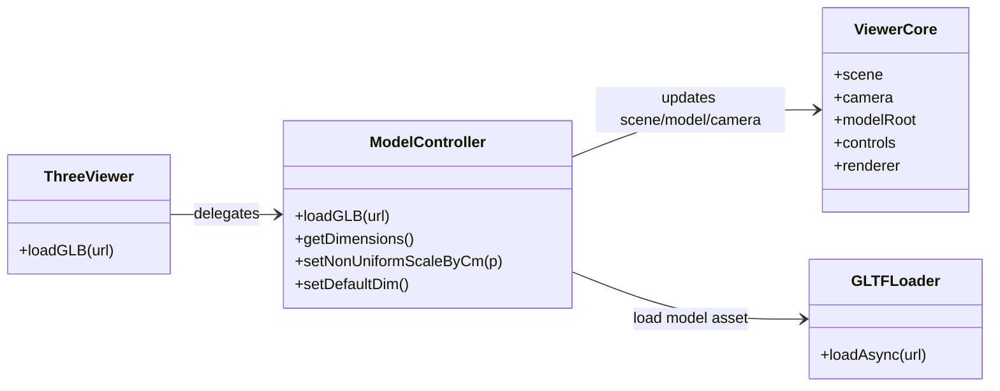

# Meccanismo load modello

## Scopo
Caricare il GLB in scena, creare pivot centrale e preparare camera/controlli/materiali base.

## File coinvolti
- `src/script/viewer/ModelController.js`
- `src/script/viewer/ThreeViewer.js`

## Flusso reale
1. `ModelController.loadGLB(url)` resetta `modelRoot` (posizione, rotazione, scala).
2. Carica il GLB con `GLTFLoader.loadAsync`.
3. Calcola bounding box del modello e il suo centro world.
4. Crea un `pivot` nel centro e rimonta la gerarchia: `modelRoot -> pivot -> model`.
5. Forza `depthTest/depthWrite=true` sui materiali mesh.
6. Salva dimensioni base (`baseSizeMeters`) per scaling successivo.
7. Adatta near/far camera e posiziona la camera in base al bounding size.
8. Fuori AR aggiorna `OrbitControls.target` al centro modello.
9. Emette evento `model:loaded`.

## Effetti indiretti
In `ThreeViewer`, su `model:loaded`:
- collega target gesture
- abilita occlusione sui materiali modello

## Sequence diagram

## Class diagram

