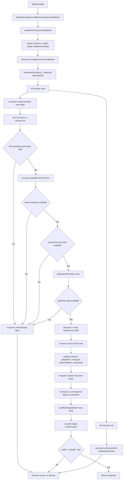
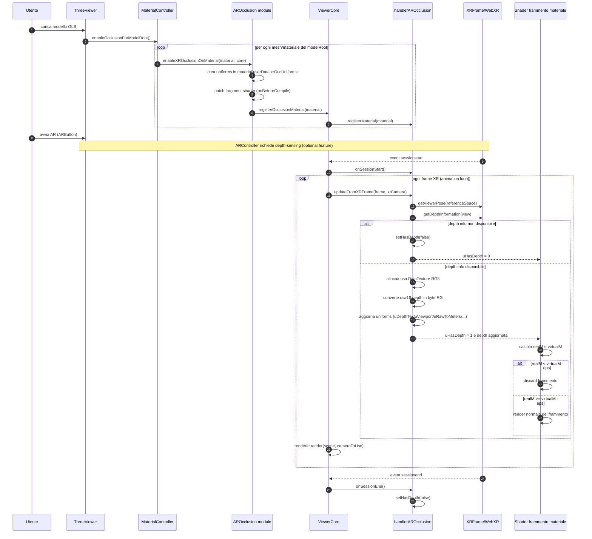
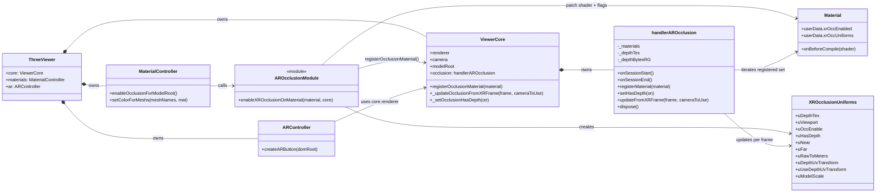

# Flusso logico occlusione XR (dettagliato)

## 1. Scopo reale del sistema
L obiettivo non e "disegnare una maschera", ma decidere pixel-per-pixel se il frammento del modello virtuale deve essere visibile oppure no.

Il criterio e:
- leggo la distanza reale dal sensore depth del device (`realM`)
- calcolo la distanza del frammento virtuale dalla camera (`virtualM`)
- se il reale e davanti al virtuale, il frammento virtuale viene scartato (`discard`)

In questo modo un oggetto fisico davanti alla camera puo coprire correttamente il modello 3D.

## 2. Mappa componenti (chi fa cosa)
- `src/script/viewer/ThreeViewer.js`
  - avvia i controller.
  - al `model:loaded` abilita occlusione su tutti i materiali del modello.
- `src/script/viewer/MaterialController.js`
  - applica `enableXROcclusionOnMaterial(...)` ai materiali.
- `src/script/ar/AROcclusion.js`
  - patch shader (`onBeforeCompile`) e definizione uniform custom.
- `src/script/viewer/ViewerCore.js`
  - ciclo di render per frame.
  - forward dei metodi `registerOcclusionMaterial`, `setHasDepth`, `updateFromXRFrame`.
  - importa il manager da `src/script/handler/handlerAROcclusion.js`.
- `src/script/handler/handlerAROcclusion.js`
  - runtime manager della depth XR (lettura frame, conversione buffer, update uniform).
- `src/script/ar/ARController.js`
  - richiede `depth-sensing` nella sessione WebXR AR.

## 3. Stato dati persistente

### 3.1 Stato per materiale (`AROcclusion.js`)
Ogni materiale abilitato riceve:
- `material.userData.xrOccEnabled = true`
- `material.userData.xrOccUniforms = { ... }`

Uniform principali:
- `uDepthTex`: texture depth RG8 aggiornata ogni frame
- `uViewport`: dimensione drawing buffer (pixel)
- `uOccEnable`: interruttore logico shader
- `uHasDepth`: segnala se la depth frame corrente e valida
- `uNear`, `uFar`: piani camera (in parte usati per validazione)
- `uRawToMeters`: fattore di conversione raw depth -> metri
- `uDepthUvTransform`: matrice di allineamento UV view/depth
- `uUseDepthUvTransform`: abilita/disabilita matrice UV
- `uModelScale`: scala world del modello (ora solo aggiornata, non usata nel confronto)

### 3.2 Stato manager (`handlerAROcclusion.js`)
`handlerAROcclusion` mantiene:
- `_materials`: `Set` di tutti i materiali registrati
- `_depthTex`: `THREE.DataTexture` condivisa per tutti i materiali
- `_depthBytesRG`: buffer `Uint8Array` (2 byte per pixel depth)
- `_depthW`, `_depthH`: dimensioni depth corrente
- flag di log (`_warnedNoDepthInfo`, `_warnedNoRefSpace`, `_loggedDepthInfo`)

## 4. Lifecycle completo

### 4.1 Bootstrap
1. `ViewerCore` crea renderer/camera/scene.
2. `ViewerCore` crea `this.occlusion = new handlerAROcclusion({ renderer, modelRoot })`.
3. Hook XR:
   - `sessionstart` -> `occlusion.onSessionStart()`
   - `sessionend` -> `occlusion.onSessionEnd()`

Effetto pratico:
- all avvio sessione resetta i flag warning/log
- a fine sessione forza `uHasDepth = 0`

### 4.2 Registrazione materiali occludibili
1. Evento `model:loaded` in `ThreeViewer`.
2. `MaterialController.enableOcclusionForModelRoot()` traversa `core.modelRoot`.
3. Per ogni materiale chiama `enableXROcclusionOnMaterial(material, core)`.
4. `enableXROcclusionOnMaterial` registra il materiale via:
   - `core.registerOcclusionMaterial(material)`
   - `ViewerCore` delega a `occlusion.registerMaterial(material)`

Nota importante:
- se il materiale e gia marcato con `xrOccEnabled`, la funzione esce subito.
- evita doppio patching shader e doppia registrazione logica.

### 4.3 Richiesta sessione AR con depth
`ARController.createARButton(...)` richiede:
- `requiredFeatures: ["hit-test"]`
- `optionalFeatures`: include `"depth-sensing"`
- `depthSensing`:
  - `usagePreference: ["cpu-optimized"]`
  - `dataFormatPreference: ["luminance-alpha"]`

Se `depth-sensing` non viene concessa, compare warning e l occlusione resta disattiva (nessun `discard`).

### 4.4 Aggiornamento ogni frame
Nel loop `renderer.setAnimationLoop(...)` in `ViewerCore`:
1. chiama la logica di placement (`onFrame`)
2. se sessione XR attiva e frame valido:
   - `_resizeFromXRFrame(frame)`
   - `_updateOcclusionFromXRFrame(frame, xrCamera)`
3. se non in XR:
   - `_setOcclusionHasDepth(false)`

Questa scelta evita artefatti: fuori AR lo shader rimane patchato, ma non applica occlusione.

## 5. Cosa fa davvero `updateFromXRFrame(...)`

### 5.1 Gate iniziali
1. prende `referenceSpace`; se manca:
   - `setHasDepth(false)`
   - warning una sola volta
   - return
2. prende `viewerPose`; se non valida:
   - `setHasDepth(false)`
   - return
3. usa la prima `view` (`pose.views[0]`)
4. prova `frame.getDepthInformation(view)` in `try/catch`
5. se `depthInfo?.data` manca:
   - `setHasDepth(false)`
   - warning una sola volta
   - return

### 5.2 Allocazione / riuso texture depth
Se dimensione depth cambia (o prima volta):
- crea `Uint8Array(w * h * 2)` per canali R/G
- crea `THREE.DataTexture(..., THREE.RGFormat, THREE.UnsignedByteType)`
- imposta:
  - `NearestFilter` (niente interpolazione)
  - `generateMipmaps = false`
  - `flipY = false`

Motivo:
- la depth raw e discreta, quindi nearest evita smoothing non fisico.

### 5.3 Conversione buffer raw16 -> RG8
`depthInfo.data` viene letto come `Uint16Array`.

Per ogni pixel:
- `R = low byte` (`value & 0xff`)
- `G = high byte` (`(value >> 8) & 0xff`)

Poi `uDepthTex.needsUpdate = true`.

Questo consente allo shader di ricostruire il `raw16` originale:
`raw16 = hi * 256 + lo`.

### 5.4 Uniform update su tutti i materiali
Per ogni materiale registrato con `xrOccUniforms`:
- `uDepthTex = _depthTex`
- `uViewport = drawingBufferSize`
- `uHasDepth = 1.0`
- `uNear`, `uFar` dalla camera XR attiva
- `uRawToMeters = depthInfo.rawValueToMeters`
- `uDepthUvTransform` + `uUseDepthUvTransform`:
  - se disponibile `normDepthBufferFromNormView`, la usa
  - altrimenti identity + flag 0
- `uModelScale = modelRoot world scale`

## 6. Cosa fa davvero lo shader patchato (`AROcclusion.js`)

### 6.1 Punto di iniezione
`onBeforeCompile` modifica il fragment shader in due punti:
1. prima di `void main()` aggiunge uniform/funzioni helper
2. sostituisce `#include <opaque_fragment>` con blocco occlusione + include originale

In pratica:
- tutta la pipeline PBR originale resta attiva
- viene solo inserito un gate di `discard` prima dell output opaco.

### 6.2 Funzioni helper
- `readRealDepthMeters(uv)`
  - legge texel RG
  - ricostruisce raw16
  - converte in metri con `uRawToMeters`
- `toDepthUv(uvView)`
  - se il device espone la matrice, converte UV view -> UV depth
  - fallback: usa UV dirette
- `isValidDepthValue(d)`
  - filtra depth non utili (`d <= 0.0001` o troppo oltre `uFar * 1.5`)

### 6.3 Confronto depth reale/virtuale
Nel blocco attivo solo se `uOccEnable > 0.5 && uHasDepth > 0.5`:
1. `uv = gl_FragCoord.xy / uViewport`
2. flip Y per passare a UV view: `uvView = vec2(uv.x, 1.0 - uv.y)`
3. eventuale trasformazione UV con `toDepthUv`
4. clamp in `[0,1]`
5. `realM = readRealDepthMeters(uvDepth)`
6. `virtualM = length(vViewPosition)`
7. confronto con epsilon fisso:
   - `eps = 0.01` metri (1 cm)
   - se `realM < virtualM - eps` -> `discard`

Significato fisico:
- se il mondo reale e davanti al punto del modello, quel pixel virtuale non deve apparire.

## 7. Comportamento di fallback (quando non occlude)
L occlusione viene bypassata in questi casi:
- non sei in sessione XR
- `referenceSpace` non disponibile
- `viewerPose` non valida
- `getDepthInformation` assente o fallita
- depth data mancante

Implementazione:
- manager imposta `uHasDepth = 0`
- shader non entra nel blocco `discard`

## 8. Cleanup e uscita sessione
- `sessionend` -> `onSessionEnd()` -> `setHasDepth(false)`
- `ViewerCore.dispose()` -> `occlusion.dispose()`:
  - svuota `_materials`
  - `dispose()` della `DataTexture`
  - reset buffer interno

## 9. Sequenza operativa compatta
```text
MODEL LOADED
  -> traverse modelRoot
  -> enableXROcclusionOnMaterial(material)
      -> attach uniforms
      -> patch shader (onBeforeCompile)
      -> register material in manager set

AR SESSION START
  -> onSessionStart() reset warning/log flags

EACH XR FRAME
  -> read referenceSpace + viewer pose
  -> getDepthInformation(view)
  -> convert raw16 depth to RG8 texture
  -> push uniforms to all registered materials
  -> fragment shader compares realM vs virtualM
  -> if realM < virtualM - 1cm => discard pixel

NO DEPTH / SESSION END
  -> uHasDepth = 0
  -> shader keeps rendering normally (no occlusion)
```

## 10. Limiti attuali visibili nel codice
- viene usata solo la prima `view` (`pose.views[0]`)
- `uNear` e poco sfruttato nella logica corrente
- `uModelScale` e aggiornato ma non entra nel confronto
- epsilon fisso (1 cm), non adattivo
- quality dipende dalla depth CPU (rumore, risoluzione, latenza)

## 11. Diagramma Mermaid (runtime)


## 12. Sequence Diagram (interazioni runtime)


## 13. Class Diagram (occlusione)


