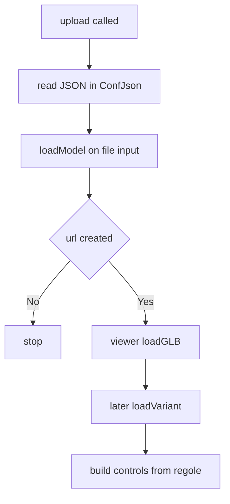
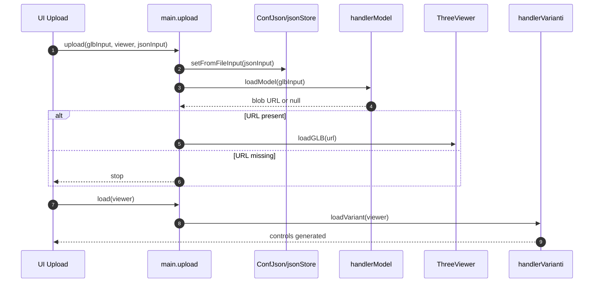
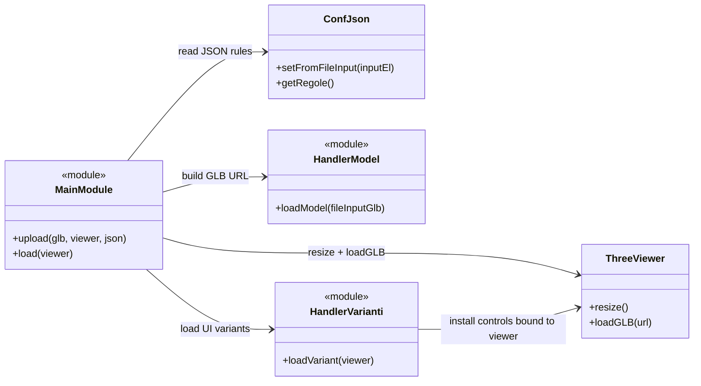

# Meccanismo upload e bootstrap

## Scopo
Caricare i file utente (JSON regole + GLB) e inizializzare il viewer con modello e varianti UI.

## File coinvolti
- `src/script/main.js`
- `src/script/config/ConfJson.js`
- `src/script/handler/handlerModel.js`
- `src/script/handler/handlerVarianti.js`

## Flusso reale
1. `upload(glb, viewer, json)` legge il JSON con `jsonStore.setFromFileInput`.
2. `loadModel(glb)` usa `@gltf-transform` per leggere/scrivere il GLB e genera una Blob URL.
3. Viene chiamato `viewer.resize()` nel frame successivo.
4. Se URL valida, viene chiamato `viewer.loadGLB(url)`.
5. In una fase separata, `load(viewer)` chiama `loadVariant(viewer)` per montare i controlli UI dalle regole JSON.

## Note
- Se il file GLB manca, `loadModel` mostra `alert` e ritorna `null`.
- Le regole JSON guidano quali meccanismi UI vengono creati.

## Sequence diagram

## Class diagram

