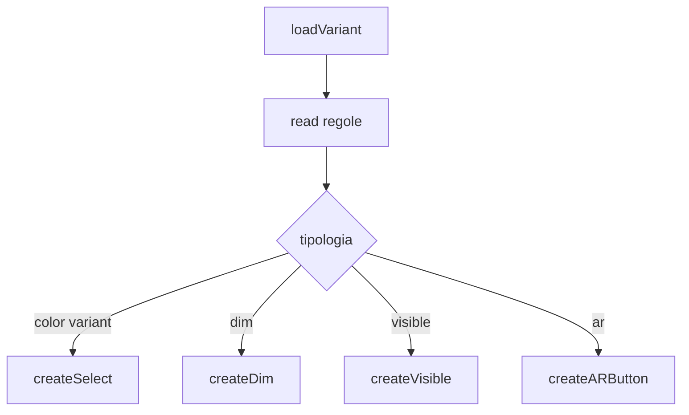
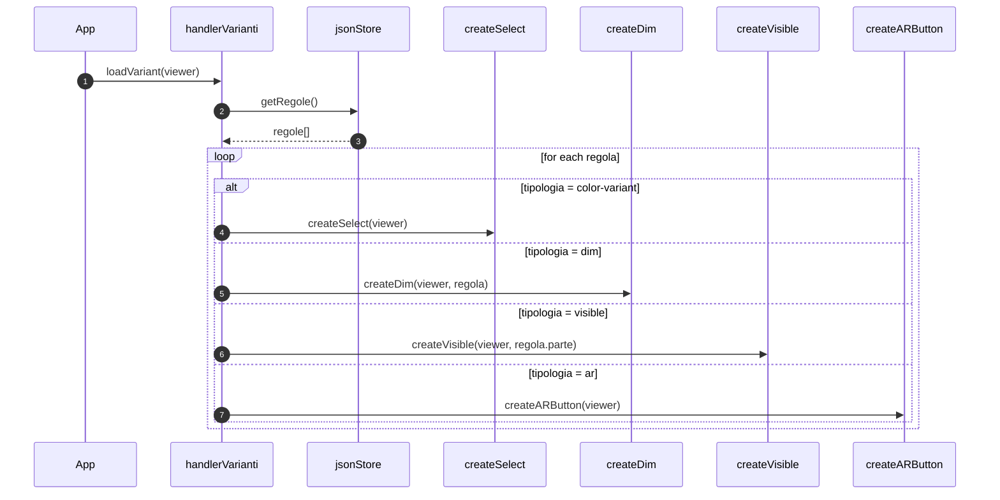
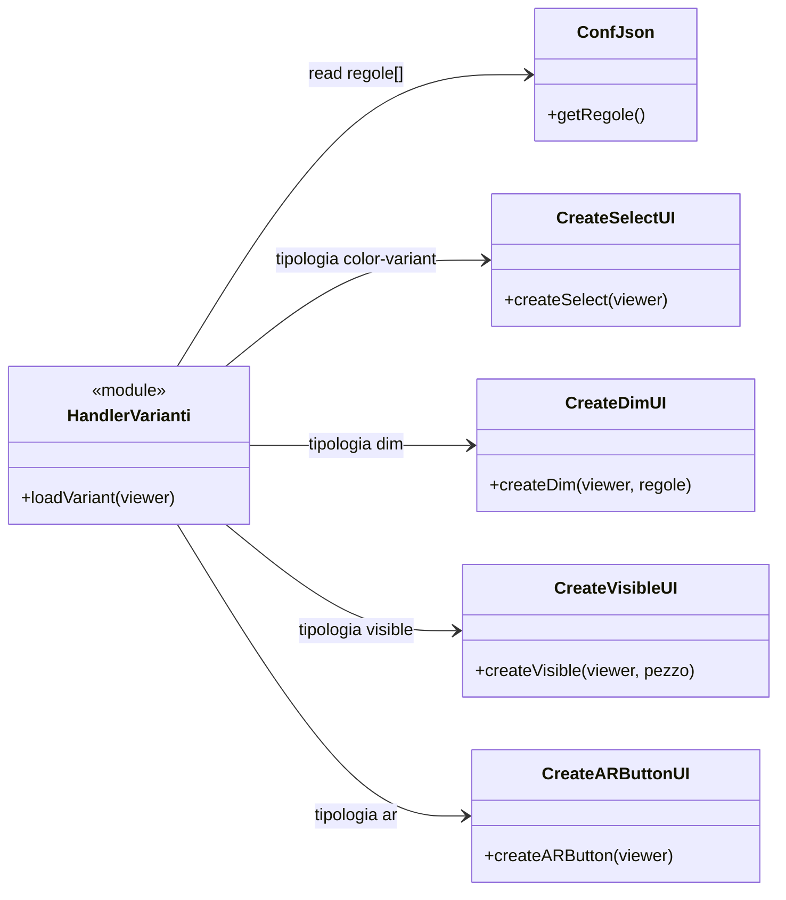

# Meccanismo varianti UI da JSON

## Scopo
Costruire dinamicamente i controlli dell interfaccia in base alle regole del file JSON.

## File coinvolti
- `src/script/handler/handlerVarianti.js`
- `src/script/config/ConfJson.js`
- `src/script/ui/createSelect.js`
- `src/script/ui/createDim.js`
- `src/script/ui/createVisible.js`
- `src/script/ui/createARButton.js`

## Flusso reale
1. `loadVariant(viewer)` legge `regole` dal `jsonStore`.
2. Per ogni regola applica uno switch su `tipologia`:
   - `color-variant` -> `createSelect`
   - `dim` -> `createDim`
   - `visible` -> `createVisible`
   - `ar` -> `createARButton`
3. Ogni meccanismo UI installa i propri listener che chiamano i metodi del viewer.

## Vantaggio
Stessa app, comportamento personalizzato da JSON senza cambiare codice.

## Sequence diagram

## Class diagram

