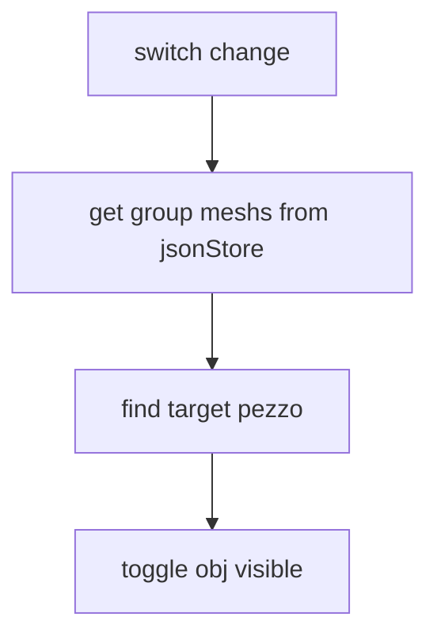
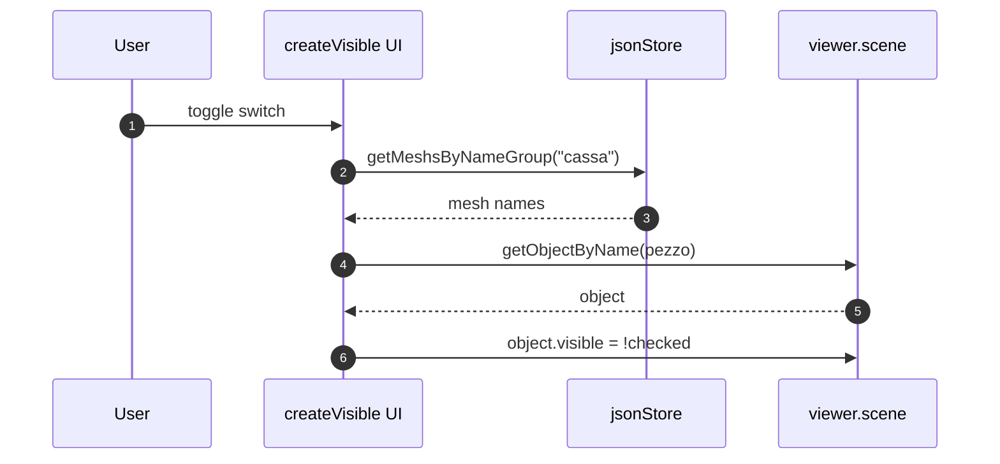
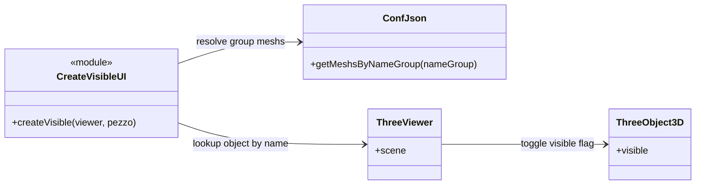

# Meccanismo visibilita componente

## Scopo
Mostrare/nascondere una parte specifica di un gruppo mesh usando uno switch UI.

## File coinvolti
- `src/script/ui/createVisible.js`
- `src/script/config/ConfJson.js`

## Flusso reale
1. `createVisible(viewer, pezzo)` crea switch nella UI.
2. Su toggle chiama `setGroupVisibilityByStore("cassa", viewer, checked, pezzo)`.
3. La funzione:
   - prende le mesh del gruppo da `jsonStore.getMeshsByNameGroup`
   - cerca solo la mesh uguale a `pezzo`
   - imposta `obj.visible = !checked`

## Nota
Il gruppo e hardcoded su `"cassa"`; il filtro finale sul nome pezzo limita l effetto a una parte specifica.

## Sequence diagram

## Class diagram

